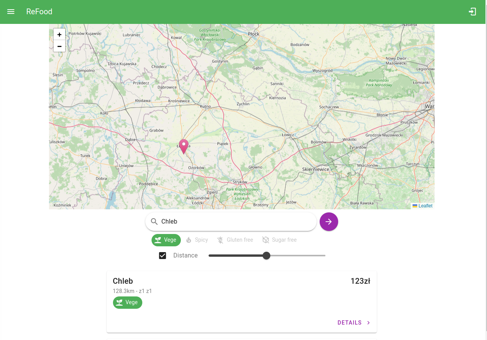

# Refood Project

This project is a food sharing platform developed using **Python, RabbitMQ, ElasticSearch JavaScript, and Vue.js**. It consists of an API, a frontend, and several services running in Docker containers.

## Project Structure

The project is divided into several parts:

- `api`: This directory contains the Python code for the backend API. It uses SQLAlchemy for database interactions and FastAPI for handling HTTP requests.
- `frontend`: This directory contains the Vue.js code for the frontend application.
- `fulltext`: This directory contains code related to Elasticsearch.
- `tests`: This directory contains the test cases for the backend API.

## Prerequisites

- Docker
- Docker Compose

## Setup

1. Clone the repository.
2. Navigate to the project directory.
3. Run `docker-compose up` to start all services.

## Services

The project uses several Docker services:

- `postgres`: PostgreSQL database.
- `api`: The backend API.
- `frontend`: The frontend application.
- `elasticsearch`: Elasticsearch service.
- `rabbitmq`: RabbitMQ service.
- `fulltext`: Service related to Elasticsearch.
- `tests`: Service for running test cases.

## Infrastructure
- ci/cd with jenkins
- Nexus artifact repository

## API

The API is developed using FastAPI and SQLAlchemy. It provides endpoints for managing users, dishes, and offers.

## Frontend

The frontend is developed using Vue.js. It provides a user interface for interacting with the API.

## Docker

The project uses Docker and Docker Compose for managing services. The `docker-compose.yml` file defines the services, networks, and volumes.

